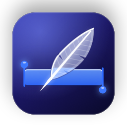

<p align="center"></p>

<h1 align="center">Quill</h1>

<p align="center">Rewrite what you select, in your own voice, in any app on your Mac.<br>Free and open source.</p>

<p align="center"><a href="https://quill.rrios.dev/download"><b>Download for macOS</b></a> · <a href="https://quill.rrios.dev">quill.rrios.dev</a></p>

---

Select text where you write — a Teams message, an e-mail, a note — and press
**⌃⌥R**. Quill shows the rewrite next to the selection; press Return and it replaces the
text where you were typing. Or type what you want ("shorter", "in English", "warmer") and
press Return.

How it rewrites depends on who will read it. Quill does it with **profiles**: a way of
rewriting for each kind of reader, which you can tune, test and give examples to.

## Profiles

| Profile | What it does |
|---|---|
| **Spelling only** | Fixes spelling, accents and punctuation. Leaves every word you chose. |
| **Work** | Clear and cordial: splits run-on sentences, drops filler, keeps technical terms. |
| **Formal** | Formal register for clients, landlords and lawyers, without inventing obligations. |
| **Friends** | Fixes typos and keeps the slang, the laughter and the emoji. |
| **Clean up dictation** | Removes the ums, repetitions and false starts of dictated text. |
| **Concise** | Cuts padding and keeps every fact and request. |

Make your own, pin a model to a profile, or give an app its default ("in Teams, use Work";
optionally applied without the picker).

## Models

Quill does not ship a model and has no server. You choose who rewrites:

- **Apple Intelligence**, on your Mac: free and private, for short texts.
- **OpenRouter**, **Vercel AI Gateway** or **OpenAI**, with your own API key.
- **Any OpenAI-compatible server**, such as Ollama or LM Studio on your network.

Each model is labelled by how well it does each profile — *works well*, *may need review*
or *not recommended* — measured on a bench of real cases, not guessed. Today Google's
Gemini 3.8 Flash (through OpenRouter or Vercel) works well on every built-in profile.

## Nothing it should not do

Every result goes through output guards before you can apply it. They check that names,
numbers, links and emoji survive; flag anything the text did not say — a figure, a date, a
greeting, a closing note, a placeholder; and catch a model that refuses or copies an
example. A flagged result tells you why, and it is never applied without you seeing it.

## Privacy

- Your text goes **only** to the provider you chose, and only when you ask for a rewrite.
  Hosted providers are asked once before the first rewrite.
- API keys live in the macOS Keychain.
- No account, no analytics, no telemetry, no server of our own. Release builds log no text.
- Password fields are never read.

## Requirements

macOS 26 or later on Apple silicon. Quill needs the **Accessibility** permission to read
the selection and replace it; the first run walks you through it. Apple Intelligence is
optional.

## Building from source

The layout mirrors the monorepo Quill is exported from: the app is in `native/quill`, and
two libraries it shares with [Ámbar](https://github.com/rrios-dev/ambar) are in
`native/packages`.

Build releases with **Xcode 27**: an older Xcode builds Quill too, but without the macOS 27
SDK it maps the on-device model's newer errors generically. The app runs on macOS 26 and
later.

```bash
cd native/quill
swift build
swift test
Scripts/make-app.sh debug      # build/debug/Quill.app, signed with your Developer ID
```

`Scripts/make-app.sh` signs with a Developer ID Application identity from your keychain;
macOS ties the Accessibility grant to the signature, so an ad-hoc signed build loses it on
every rebuild. `Scripts/verify.sh` is the maintainer's release gate and also checks the rest
of the monorepo; outside it, `swift test` and `Scripts/check-localization.sh` are what CI
runs.

The design documents are in [`docs/initiatives/quill`](docs/initiatives/quill):
[product](docs/initiatives/quill/PRODUCT.md),
[architecture](docs/initiatives/quill/ARCHITECTURE.md),
[providers](docs/initiatives/quill/PROVIDERS.md) and
[the bench](docs/initiatives/quill/BENCH.md) that measures each model and profile
(`quill-bench`, in `native/quill/tools/QuillBench`).

## License

[MIT](LICENSE). Made by [Roberto Ríos](https://rrios.dev).
